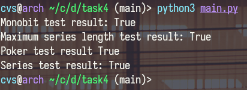

# Task 4 for Distributed Lab cryptograhy course
### Task goal:
Implement tests to check random bit sequences for compliance with FIPS 140-3 standard
### Program execution example:
```sh
python3 test.py
```
### Output:

